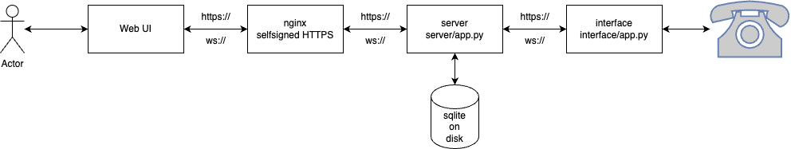

# weddingRingManager

This repository contains the source code for weddingRing.
It consists of two parts:

- `server` - A Flask based python server that leverages sqlite to maintain track of records, configuration and messages. It hosts a UI that can be accessed directly to manage all settings and exposes an API explorer.
- `interface` - The interfacing application using a state machine. It maintains the correct flow of events for the physical phone unit and will perform the actual playback and recording work

## Architecture

## Starting

Navigate to the application you want to execute, then use the following routine to start up:

Initial:

- `sh setup.sh install` - this uses the requirements.txt and will install all needed dependencies

Start:

- `sh setup.sh start` - this will execute the application

## Setup

Check out the repository via `git clone` in the pi home directory `/home/pi`.

Move to the `system` directory, run `sh setup.sh install`. This will install all OS based dependencies and configure I2S communication for the DAC and ADC. Without that, audio will not work. It also installs nginx to listen on port 443 with self-signed certificates.

Move to the `server` directory, run `sh setup.sh install`. This will install all python dependencies for the server in a virtual environment.

Move to the `interface` directory, run `sh setup.sh install`. This will install all python dependencies for the interface in a virtual environment.

Move to the `system` directory, run `sh setup.sh systemd`. This will install three system services:

- `phone_interface`: starts the phone interface application
- `phone_server`: starts the server with application logic
- `phone_automount`: starts a script which will automatically mount a USB storage device (`/dev/sda1`) and copies all recordings over. It will not delete existing copies, even if deleted in weddingRing management UI.

All services are being configured to run automatically and restart.

## Application states

These statuses are controlled by the interface.

### `on-hook`

**on-hook LED is on**

The phone is not picked up. In this mode, no playback or recording happens. The phone is able to ring if automated ringing is enabled.

If the phone is picked up during that state, it will be set into `off-hook` mode.

### `off-hook`

**off-hook LED is on**

The phone is picked up. If messages are enabled, the phone will play one of the messages (either in order or randomized) and also immediately start recording the input coming from the phone.  
This means the recording will also contain the playback message.  

The playback message is being retrieved via REST API from the server by the interface and then played back.

In this mode, the phone can not ring. If the phone is put `on-hook` again, the message playback is stopped and the the recording is stopped as well. The recording is saved temporarily and then sent to the server via REST API, where it will be persisted as a unique record.

After the phone has been put `on-hook` again and data is saved, the phone is ready again to be picked up.

### `ringing`

**ringing LED is on**

The phone rings. It will do so in the configured fashion that is maintained in the server. The interface will get configuration updated automatically and adjust the ringing settings accordingly.

If the phone is picked up during that state, it will be set into `off-hook` mode.

## LED Arrangement

Going from left to right on the front panel.

| LED | Color | Meaning | usual state |
| -- | -- | -- | -- |
| on-hook | blue | if active, the phone is on-hook | solid on/off based on phone state |
| off-hook | blue | if active, the phone is off-hook | solid on/off based on phone state |
| rpi activity | red | displays the activity of the Raspberry Pi | blinking, based on system load |
| interface heartbeat | red | displays the heartbeat of the interface application | 0.1s on / 0.4s off |
| server heartbeat | red | displays the heartbeat of the server application | 0.8s on / 0.2s off |
| ringing | blue | if active, the phone is on-hook | solid on/off based on phone state |
| 3.3V | green | shows if the voltage is present | solid on |
| 5V | green | shows if the voltage is present | solid on |
| 12V | green | shows if the voltage is present | solid on |
| -12V | green | shows if the voltage is present | solid on |
| 48V | green | shows if the voltage is present | solid on |
